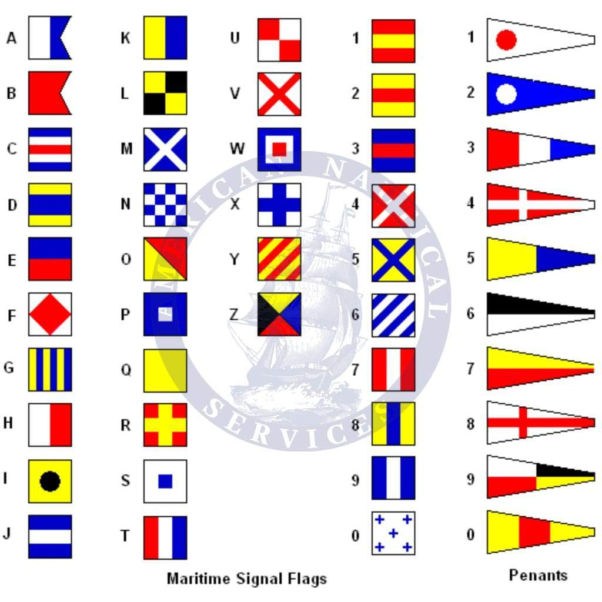
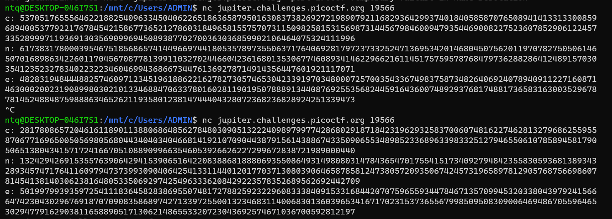
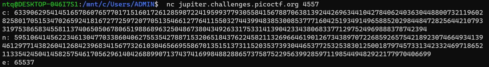
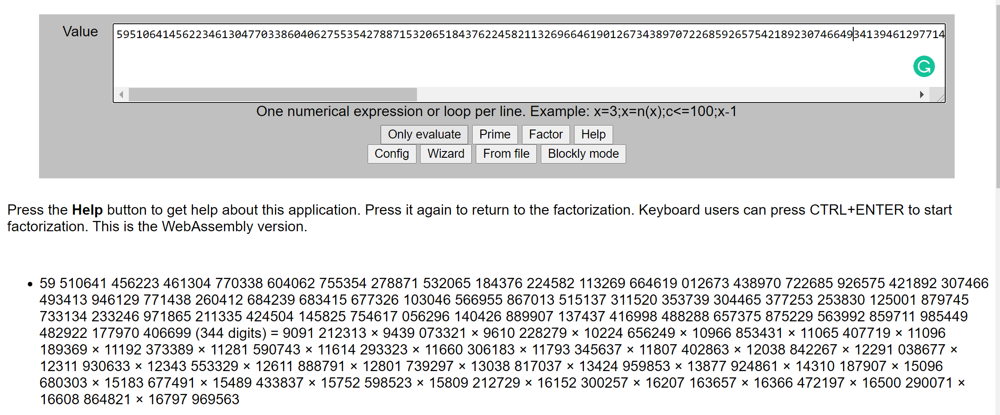
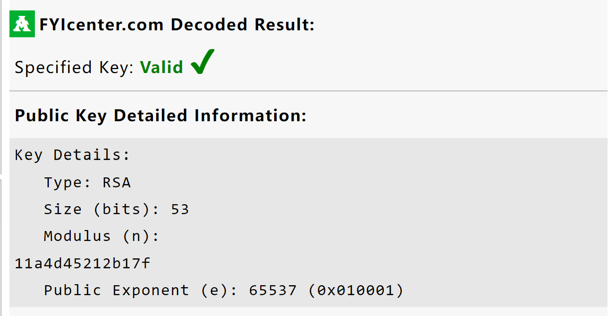
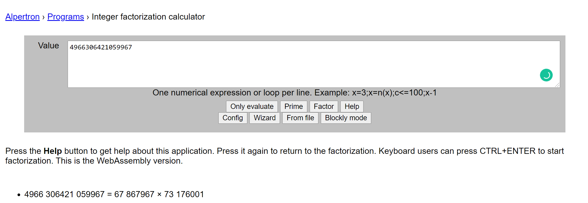

# Write up
## 1.The numbers

#### Description

>The numbers... what do they mean?


>Thay đổi số tương ứng với thứ tự trong bảng chữ cái 


``` py
nums = [16, 9, 3, 15, 3, 20, 6, '{', 20, 8, 5, 14, 21, 13, 2, 5, 18, 19, 13, 1, 19, 15, 14, '}']
for n in nums:
    if type(n) is int:
        print(chr(n+64), end='')
    else:
        print(n, end='')
```

`flag : PICOCTF{THENUMBERSMASON}`<br>

## 2.Easy1

### Description

>The one time pad can be cryptographically secure, but not when you know the key. Can you solve this? We've given you the encrypted flag, key, and a table to help UFJKXQZQUNB with the key of SOLVECRYPTO. Can you use this table to solve it?

`ciphertext: UFJKXQZQUNB`
`key: SOLVECRYPTO `
>Đây là mã OTP. Giải bằng cách xor bản mã với key. Online tool  [DCODE](https://www.dcode.fr/vernam-cipher)

`flag: picoCTF{CRYPTOISFUN}`

## 3.13

### Description

>Cryptography can be easy, do you know what ROT13 is? cvpbPGS{abg_gbb_onq_bs_n_ceboyrz}

>online tool ROT13 [DCODE](https://rot13.com/)

`flag: picoCTF{not_too_bad_of_a_problem}`

## 4.Caesar

### Description

>Decrypt this [message](ciphertext).

>picoCTF{dspttjohuifsvcjdpoabrkttds}

>online tool Caesar [Dcode](https://www.dcode.fr/caesar-cipher)

`flag: picoCTF{crossingtherubiconljmawiae}`

## 5. la cifra de

### Description

>I found this cipher in an old book. Can you figure out what it says? Connect with nc jupiter.challenges.picoctf.org 32411.

>Sau khi connect thấy đoạn mã [Encrypted](encrypted)

>Thử qua các loại mã cổ điển thì thấy mã Vigenère đúng. Online tool [DCODE](https://www.guballa.de/vigenere-solver)

`flag: picoCTF{b311a50_0r_v1gn3r3_c1ph3rb6cdf651}`

## 6.Tapping

### Description

>Theres tapping coming in from the wires. What's it saying nc jupiter.challenges.picoctf.org 21610

`Sau khi connect: .--. .. -.-. --- -.-. - ..-. { -- ----- .-. ... ...-- -.-. ----- -.. ...-- .---- ... ..-. ..- -. ...-- ----. ----- ..--- ----- .---- ----. ..... .---- ----. }`

>online tool [DCODE](https://morsedecoder.com/)

`flag: PICOCTF{M0RS3C0D31SFUN3902019519}`

## 7.Flags

### Description

>What do the [flags](flag.png) mean?

`Khi nhìn vào ảnh thấy đây là những cờ mã tín hiệu (signal flags)`
>

`flag: PICOCTF{F1AG5AND5TUFF}`

## 8.Mr-Worldwide

### Description

>A musician left us a [message](message.txt). What's it mean?

``` 
chỗ này thấy giống toạ độ nên mình search google, 
thấy cái đầu nó ra cái map của Kyoto, nên cứ tra thêm rồi ghép lại thành flag xem mà ai ngờ đúng ^^
[K]yoto             (35.028309, 135.753082)
[O]dessa            (46.469391, 30.740883)
[D]ayton            (39.758949, -84.191605)
[I]stanbul          (41.015137, 28.979530)
[A]bu Dhabi         (24.466667, 54.366669)
[K]uala Lumpur      (3.140853, 101.693207)
_
[A]ddis Ababa       (9.005401, 38.763611)
[L]oja              (-3.989038, -79.203560)
[A]msterdam         (52.377956, 4.897070)
[S]leepy Hollow     (41.085651, -73.858467)
[K]odiak            (57.790001, -152.407227)
[A]lexandria        (31.205753, 29.924526)
---------------------------------------------
```
`flag: picoCTF{KODIAK_ALASKA}`

## 9.rsa-pop-quiz

### Description

>Class, take your seats! It's PRIME-time for a quiz... nc jupiter.challenges.picoctf.org 58617

```
Sau khi connect:
Good morning class! It's me Ms. Adleman-Shamir-Rivest
Today we will be taking a pop quiz, so I hope you studied. Cramming just will not do!
You will need to tell me if each example is possible, given your extensive crypto knowledge.
Inputs and outputs are in decimal. No hex here!
#### NEW PROBLEM ####
q : 60413
p : 76753
##### PRODUCE THE FOLLOWING ####
n
IS THIS POSSIBLE and FEASIBLE? (Y/N):Y
#### TIME TO SHOW ME WHAT YOU GOT! ###
n: 4636878989
Outstanding move!!!


#### NEW PROBLEM ####
p : 54269
n : 5051846941
##### PRODUCE THE FOLLOWING ####
q
IS THIS POSSIBLE and FEASIBLE? (Y/N):Y
#### TIME TO SHOW ME WHAT YOU GOT! ###
q: 93089
Outstanding move!!!


#### NEW PROBLEM ####
e : 3
n : 12738162802910546503821920886905393316386362759567480839428456525224226445173031635306683726182522494910808518920409019414034814409330094245825749680913204566832337704700165993198897029795786969124232138869784626202501366135975223827287812326250577148625360887698930625504334325804587329905617936581116392784684334664204309771430814449606147221349888320403451637882447709796221706470239625292297988766493746209684880843111138170600039888112404411310974758532603998608057008811836384597579147244737606088756299939654265086899096359070667266167754944587948695842171915048619846282873769413489072243477764350071787327913
##### PRODUCE THE FOLLOWING ####
q
p
IS THIS POSSIBLE and FEASIBLE? (Y/N):N
Outstanding move!!!


#### NEW PROBLEM ####
q : 66347
p : 12611
##### PRODUCE THE FOLLOWING ####
totient(n)
IS THIS POSSIBLE and FEASIBLE? (Y/N):Y        
#### TIME TO SHOW ME WHAT YOU GOT! ###
totient(n): 836623060
Outstanding move!!!


#### NEW PROBLEM ####
plaintext : 6357294171489311547190987615544575133581967886499484091352661406414044440475205342882841236357665973431462491355089413710392273380203038793241564304774271529108729717
e : 3
n : 29129463609326322559521123136222078780585451208149138547799121083622333250646678767769126248182207478527881025116332742616201890576280859777513414460842754045651093593251726785499360828237897586278068419875517543013545369871704159718105354690802726645710699029936754265654381929650494383622583174075805797766685192325859982797796060391271817578087472948205626257717479858369754502615173773514087437504532994142632207906501079835037052797306690891600559321673928943158514646572885986881016569647357891598545880304236145548059520898133142087545369179876065657214225826997676844000054327141666320553082128424707948750331
##### PRODUCE THE FOLLOWING ####
ciphertext
IS THIS POSSIBLE and FEASIBLE? (Y/N):Y
#### TIME TO SHOW ME WHAT YOU GOT! ###
ciphertext: 256931246631782714357241556582441991993437399854161372646318659020994329843524306570818293602492485385337029697819837182169818816821461486018802894936801257629375428544752970630870631166355711254848465862207765051226282541748174535990314552471546936536330397892907207943448897073772015986097770443616540466471245438117157152783246654401668267323136450122287983612851171545784168132230208726238881861407976917850248110805724300421712827401063963117423718797887144760360749619552577176382615108244813
Outstanding move!!!


#### NEW PROBLEM ####
ciphertext : 107524013451079348539944510756143604203925717262185033799328445011792760545528944993719783392542163428637172323512252624567111110666168664743115203791510985709942366609626436995887781674651272233566303814979677507101168587739375699009734588985482369702634499544891509228440194615376339573685285125730286623323
e : 3
n : 27566996291508213932419371385141522859343226560050921196294761870500846140132385080994630946107675330189606021165260590147068785820203600882092467797813519434652632126061353583124063944373336654246386074125394368479677295167494332556053947231141336142392086767742035970752738056297057898704112912616565299451359791548536846025854378347423520104947907334451056339439706623069503088916316369813499705073573777577169392401411708920615574908593784282546154486446779246790294398198854547069593987224578333683144886242572837465834139561122101527973799583927411936200068176539747586449939559180772690007261562703222558103359
##### PRODUCE THE FOLLOWING ####
plaintext
IS THIS POSSIBLE and FEASIBLE? (Y/N):N
Outstanding move!!!


#### NEW PROBLEM ####
q : 92092076805892533739724722602668675840671093008520241548191914215399824020372076186460768206814914423802230398410980218741906960527104568970225804374404612617736579286959865287226538692911376507934256844456333236362669879347073756238894784951597211105734179388300051579994253565459304743059533646753003894559
p : 97846775312392801037224396977012615848433199640105786119757047098757998273009741128821931277074555731813289423891389911801250326299324018557072727051765547115514791337578758859803890173153277252326496062476389498019821358465433398338364421624871010292162533041884897182597065662521825095949253625730631876637
e : 65537
##### PRODUCE THE FOLLOWING ####
d
IS THIS POSSIBLE and FEASIBLE? (Y/N):Y
#### TIME TO SHOW ME WHAT YOU GOT! ###
d: 1405046269503207469140791548403639533127416416214210694972085079171787580463776820425965898174272870486015739516125786182821637006600742140682552321645503743280670839819078749092730110549881891271317396450158021688253989767145578723458252769465545504142139663476747479225923933192421405464414574786272963741656223941750084051228611576708609346787101088759062724389874160693008783334605903142528824559223515203978707969795087506678894006628296743079886244349469131831225757926844843554897638786146036869572653204735650843186722732736888918789379054050122205253165705085538743651258400390580971043144644984654914856729
Outstanding move!!!


#### NEW PROBLEM ####
p : 153143042272527868798412612417204434156935146874282990942386694020462861918068684561281763577034706600608387699148071015194725533394126069826857182428660427818277378724977554365910231524827258160904493774748749088477328204812171935987088715261127321911849092207070653272176072509933245978935455542420691737433
ciphertext : 15898528329836486259454280642537682745047492250031819804208947573732209296147142448425785475270839697919293976182333838349380319082449313123936042811917218253196274432195116911131311101664245124078266845291992250418272429673592762174381527121624558596357902629676671110003023710107905410987270486412752306303470410502366293287214002128769133995449197216690029130480234844827254205117539992852496638836353167147769854523276743309449394023887611024408163270210444112592577810624181267012402352918669635578760260278590557042623644240179185252741450067430771092134328724271261927055861090533852597204599189199436235384288
e : 65537
n : 23952937352643527451379227516428377705004894508566304313177880191662177061878993798938496818120987817049538365206671401938265663712351239785237507341311858383628932183083145614696585411921662992078376103990806989257289472590902167457302888198293135333083734504191910953238278860923153746261500759411620299864395158783509535039259714359526738924736952759753503357614939203434092075676169179112452620687731670534906069845965633455748606649062394293289967059348143206600765820021392608270528856238306849191113241355842396325210132358046616312901337987464473799040762271876389031455051640937681745409057246190498795697239
##### PRODUCE THE FOLLOWING ####
plaintext
IS THIS POSSIBLE and FEASIBLE? (Y/N):Y
#### TIME TO SHOW ME WHAT YOU GOT! ###
plaintext: 14311663942709674867122208214901970650496788151239520971623411712977119660454037678408741501
Outstanding move!!!
```

```python

plaintext = 14311663942709674867122208214901970650496788151239520971623411712977119660454037678408741501
print(long_to_bytes(plaintext))

b'picoCTF{wA8_th4t$_ill3aGal..o26cefcb2}'
```

`flag: picoCTF{wA8_th4t$_ill3aGal..o26cefcb2}`

## 10.waves over lambda

### Description

>We made a lot of substitutions to encrypt this. Can you decrypt it? Connect with nc jupiter.challenges.picoctf.org 43522.

> Sau khi connect nhận được ciphertext:
QOCGHVWY JXHX NY AOLH EDVG - EHXZLXCQA_NY_Q_OTXH_DVUKPV_OGEUVLCHVE ------------------------------------------------------------------------------- MX MXHX COW ULQJ UOHX WJVC V ZLVHWXH OE VC JOLH OLW OE OLH YJNI WNDD MX YVM JXH YNCR, VCP WJXC N LCPXHYWOOP EOH WJX ENHYW WNUX MJVW MVY UXVCW KA V YJNI EOLCPXHNCG NC WJX YXV. N ULYW VQRCOMDXPGX N JVP JVHPDA XAXY WO DOOR LI MJXC WJX YXVUXC WODP UX YJX MVY YNCRNCG; EOH EHOU WJX UOUXCW WJVW WJXA HVWJXH ILW UX NCWO WJX KOVW WJVC WJVW N UNGJW KX YVNP WO GO NC, UA JXVHW MVY, VY NW MXHX, PXVP MNWJNC UX, IVHWDA MNWJ EHNGJW, IVHWDA MNWJ JOHHOH OE UNCP, VCP WJX WJOLGJWY OE MJVW MVY AXW KXEOHX UX.


>Sau khi thử 1 loạt các loại mã kiểu Caesae, Veigenere, bla bla. Mình nghĩ là cái này có thể là mã thay thế nên đã cho nên tool này [DCODE](https://www.dcode.fr/monoalphabetic-substitution) thì nhận được plaintext.

`flag: picoCTF{FREQUENCY_IS_C_OVER_LAMBDA_OGFMAUNRAF}`

# 11.miniRSA

## Description

>Let's decrypt this: [ciphertext](miniRSA.txt) Something seems a bit small.

```
vì e = 3 nên mình thấy cái thư viện gmpy2 nó giải quyết được nên cho vào code luôn
```
``` python
from Crypto.Util.number import *
import gmpy2

n = 29331922499794985782735976045591164936683059380558950386560160105740343201513369939006307531165922708949619162698623675349030430859547825708994708321803705309459438099340427770580064400911431856656901982789948285309956111848686906152664473350940486507451771223435835260168971210087470894448460745593956840586530527915802541450092946574694809584880896601317519794442862977471129319781313161842056501715040555964011899589002863730868679527184420789010551475067862907739054966183120621407246398518098981106431219207697870293412176440482900183550467375190239898455201170831410460483829448603477361305838743852756938687673
e = 3
c = 2205316413931134031074603746928247799030155221252519872650073010782049179856976080512716237308882294226369300412719995904064931819531456392957957122459640736424089744772221933500860936331459280832211445548332429338572369823704784625368933 

d = gmpy2.iroot(c,e)[0]

print(long_to_bytes(d))
```
`flag: picoCTF{n33d_a_lArg3r_e_ccaa7776}`

# 12.b00tl3gRSA2

## Description

>In RSA d is a lot bigger than e, why don't we use d to encrypt instead of e? Connect with nc jupiter.challenges.picoctf.org 19566.

> mình có đưa nó vào cái [fermatfactor](5.RSA5.py) nhưng mà số to quá không factor được. 
``` py
c = 102282299255349339563496901591160477749797419859706684582659354069672944522510152621834454630506069897750237388334501371029802129112540405484072889677852205075901079740894668459396238463488302263133933185711968471912284873550308515460340171032193194056301365932716755210832382608070686671733304571543303782081
n = 113679961422666410414648715858792023342668862765464362475667306335094793804632833726719159810503312119538631411922581229775151185130653765338504701138039564666238977251296709429753223644271306996955039771016813200726060799943170174337836523465068563820705390436229789892395111677685603639333794914310362695861
e = 13344216903803541439490556038599371890308551829572872431226766370689598985901710329426896202484123169135155583135029333058581229949648586550332127895004931630252561418671045025840639189145166235769268544531922659931164227780945654170590629888190701802923100486684595154749509104694931158299874485681520626109
import owiener
  e = 46395729378821432723335429365001566698560631871941393104549626550607851523628391607157830108059622225405846790140321927543690425569023926573788657110269871673403652081946192436333475968826260003743253765598003387820694511183668658190196195151456254732632334316496035902610376454630418619583173294878061285065
  n = 98348381676741606119262348684998792791136531066773072416239249450049706158554643101151557777012758734237570950785208078579126028415341756181595472427329857136769491354150252447593550913714820820436376499708956379639751730427193283876234132259677395616001865040976643167089089797366411614884592041616578040851
import owiener
d=owiener.attack(e,n)
  

from Crypto.Util.number import *
print(long_to_bytes(pow(c,d,n)))
# b'picoCTF{bad_1d3a5_2438125}'
```

`flag: picoCTF{bad_1d3a5_2438125} `

# 13.AES-ABC

# 14.b00tl3gRSA2

## Description

>Why use p and q when I can use more? Connect with nc jupiter.challenges.picoctf.org 4557.

>

> factor n ở trên đây [factor](https://www.alpertron.com.ar/ECM.HTM) thì được như sau: 

``` py
arr = [9091212313, 9439073321, 9610228279, 10224656249,10966853431, 11065407719, 11096189369,11192373389,11281590743,11614293323, 11660306183, 11793345637, 11807402863,12038842267,12291038677, 12311930633, 12343553329, 12611888791, 12801739297 ,13038817037 ,13424959853 ,13877924861 , 14310187907 , 15096680303 , 15183677491 ,15489433837 , 15752598523 ,15809212729 ,16152300257 ,16207163657 ,16366472197,16500290071 ,16608864821 ,16797969563]
phi = 1
from Crypto.Util.number import *
import gmpy2
for i in arr:
    phi *= i-1
  
print(phi)
d = gmpy2.invert(e,phi)
print(long_to_bytes(pow(ct,d,n)))
# b'picoCTF{too_many_fact0rs_4025135}'
```
`flag: picoCTF{too_many_fact0rs_4025135}`

# 15.john_pollard

## Description

>Sometimes RSA [certificates](cert.txt) are breakable.
>Mình copy toàn bộ rồi cho lên trang này [Dcode](http://certificate.fyicenter.com/2145_FYIcenter_Public_Private_Key_Decoder_and_Viewer.html#Result) để lấy được n và e  Vì n còn đang ở dạng hex nên ta phải chuyển nó về kiểu int.
``` python
print(int("11a4d45212b17f", 16))
# 4966306421059967
```
>

`flag: picoCTF{73176001, 67867967}`


